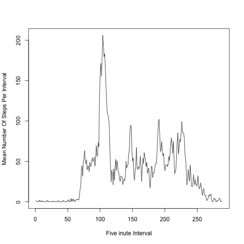
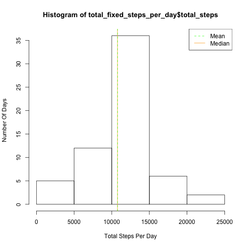

#FitBandBone


This is a series of computations related to data provided for the Reproducible Research course's first assignment. The data consists of measurements made from a fitness tracker of the Fitbit, Nike Fuelband, or Jawbone variety. As I was unsure of the actual source of the data, I elected to use the "fitbandbone"" portmanteau. Throughout the exercises, we will make use of only three extra libraries.


```r
library(plyr)
library(gridExtra)
library(ggplot2)
```

### Loading and preprocessing the data

To begin, we read in the data and typecast the date information to make future computations more simple.


```r
fitbandbone <- read.table("activity.csv", sep=",", header=TRUE)
fitbandbone$date <- as.Date(fitbandbone$date)
```

### What is mean total number of steps taken per day?

Our first task asks us to compute the total number of steps taken over each day, i.e., sum the steps value for each interval for each particular day. Bearing in mind that there are numerous 'NA' values contained in our data set, we explicitly exclude them from the sum.


```r
total_steps_per_day <- ddply(fitbandbone,.(date),summarize,
                             total_steps=sum(steps, na.rm=TRUE))
```

We then generate a histogram of these data and include the evaluation of the mean and median values. The mean and median values follow:

```r
mean_steps <- mean( total_steps_per_day$total_steps, na.rm =TRUE)
median_steps <- median( total_steps_per_day$total_steps, na.rm =TRUE)
print(mean_steps)
```

```
## [1] 9354.23
```

```r
print(median_steps)
```

```
## [1] 10395
```

We make simple use of the <code>hist</code> function to compute the histogram.


### What is the average daily activity pattern?

We wish to make a plot of the mean number of steps taken for each five minute interval. To do that, we need to collapse all of the different days into one single vector consisting of the mean values for each interval, where the mean is taken over all of the days.

```r
total_steps_by_interval <- ddply(fitbandbone,
                                  .(interval),
                                  summarize,
                                  mean_steps=mean(steps, na.rm=TRUE))
```

We can now construct the desired plot.

```r
plot( total_steps_by_interval$mean_steps, 
      ylab="Mean Number Of Steps Per Interval",
      xlab="Five inute Interval",
      type="l")
```



To compute the interval which contains, on average, the largest number of steps taken, we use a combination of subsetting and the <code>max</code> function. 

```r
total_steps_by_interval[total_steps_by_interval$mean_steps==max(total_steps_by_interval$mean_steps),]
```

```
##     interval mean_steps
## 104      835   206.1698
```
We see that the 104th interval in our data frame, corresponding to the 835 minute mark, contains the largest number of steps on average. We should note that in the full data set, this would equate with the 167th interval, but since we have removed instances of 'NA's we have truncated our data frame.

### Imputting missing values.

We compute the total number of rows containing 'NA' values in our data set to be:

```r
sum(is.na(fitbandbone$steps))
```

```
## [1] 2304
```

To account for this we would like to replace the 'NA' values with a reasonable numeric value computed from the existing data. Replacing the 'NA' values with the mean of the existing data values for that interval seems as good a choice as any. We use the <code>ifelse</code>function to search for instances where an interval value is stored as 'NA'. When it is encountered, it is replaced by the mean over all days of all existing values for that particular interval.


```r
fitbandbone_fixed <- fitbandbone
fitbandbone_fixed$steps <- ifelse(is.na(fitbandbone$steps), 
                            total_steps_by_interval$mean_steps[match(fitbandbone$interval, total_steps_by_interval$interval)], fitbandbone$steps)
```

As before, we generate a histogram of the data stored in our fixed data frame and compute the mean and median. We first present the mean and median.


```r
total_fixed_steps_per_day <- ddply(fitbandbone_fixed,.(date),summarize,
                             total_steps=sum(steps, na.rm=TRUE))
mean_fixed_steps <- mean( total_fixed_steps_per_day$total_steps, na.rm =TRUE)
median_fixed_steps <- median( total_fixed_steps_per_day$total_steps, na.rm =TRUE)
print(mean_fixed_steps)
```

```
## [1] 10766.19
```

```r
print(median_fixed_steps)
```

```
## [1] 10766.19
```

In this case, we can see that the mean and median values are identical. As such, their mutual appearance on the histogram is perhaps of less interest.


```r
hist(total_fixed_steps_per_day$total_steps, 
     ylab="Number Of Days", 
     xlab="Total Steps Per Day")
abline(v=median_fixed_steps, col="orange")
abline(v=mean_fixed_steps, col="green",lty=2)
legend("topright", legend=c("Mean", "Median"), col=c("green", "orange"), lty=c(2,1) )
```



From these computations and the histogram, we can see that imputting the missing values into our data set did indeed have an impact on the statistics of the underlying data. In particular, the mean and median have converged to the same value, but also, the histogram shows us that the underlying data appears to align better with a normal distribution, as we would expect.

### Are there differences in activity patterns between weekdays and weekends?

As peoples' daily routines tend to change significantly between the working week and the week end, we seek to examine the differences in our data between those two distinctions. To begin, we create a new factor variable which separates weekday data from weekend data.


```r
fitbandbone_fixed["weekday"]<- weekdays(fitbandbone_fixed$date)
workweekdays <- c('Monday', 'Tuesday', 'Wednesday', 'Thursday', 'Friday')
fitbandbone_fixed$daytype <- factor((fitbandbone_fixed$weekday %in% workweekdays), 
                   levels=c(FALSE, TRUE), labels=c('weekend', 'weekday'))
```

We then make use of the new factor variable to collapse the interval data down into two vectors. One which contains the mean steps taken over an interval on all weekdays and the other which contains the mean steps taken over an interval on all weekend days.


```r
total_fixed_steps_by_interval <- ddply(fitbandbone_fixed,
                                 .(interval,daytype),
                                 summarize,
                                 mean_steps=mean(steps, na.rm=TRUE))
```

We finish with a plot comparing the mean number of steps taken on an interval over weekdays and over weekend days.


```r
weekday_data <- total_fixed_steps_by_interval[total_fixed_steps_by_interval$daytype=="weekday",]
weekend_data <- total_fixed_steps_by_interval[total_fixed_steps_by_interval$daytype=="weekend",]

plot1 <- qplot(data=weekend_data, x=interval, y=mean_steps, geom="line", main="Weekend")
plot2 <- qplot(data=weekday_data, x=interval, y=mean_steps, geom="line", main="Weekday")

grid.arrange(plot1, plot2, nrow=2)
```


We see that during the weekday there appears to be a stretch of time in which the average number o steps taken seems to be lower than on the weekday and relatively flat. We suspect that his correlates well with the fact that during the work day, the individual was likely sitting at a desk for long periods at a time.
